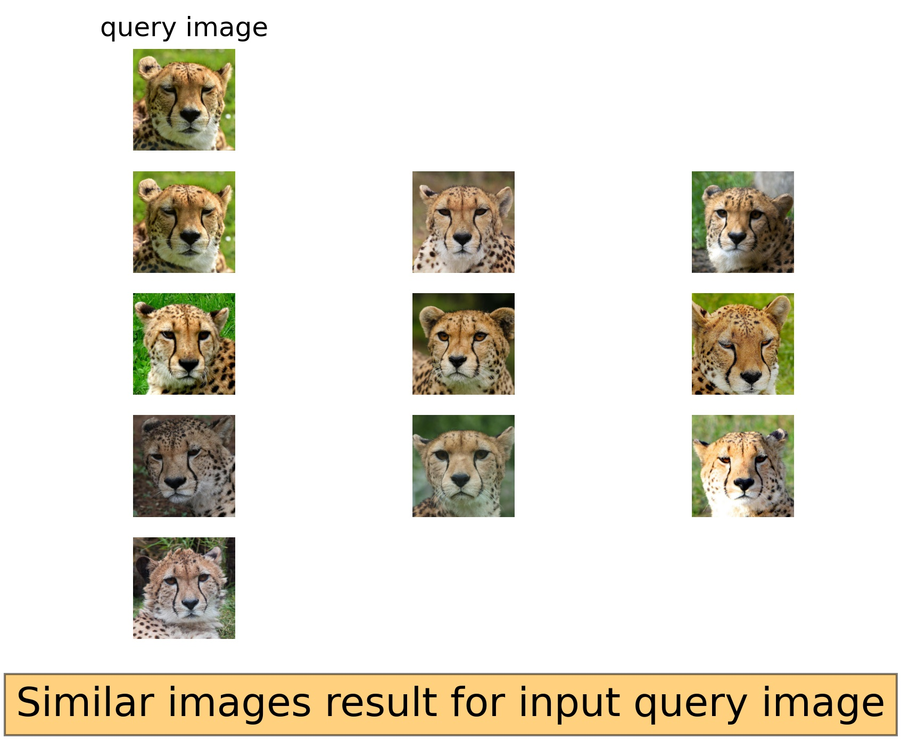
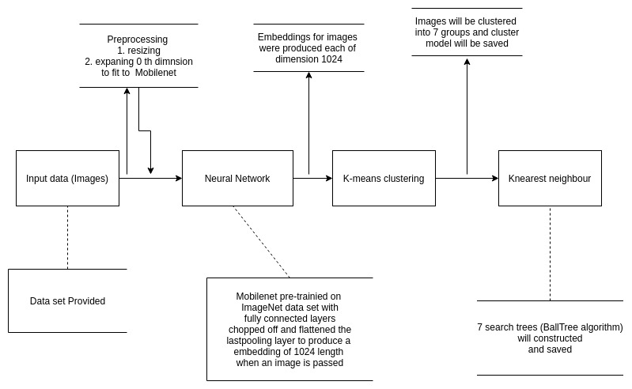
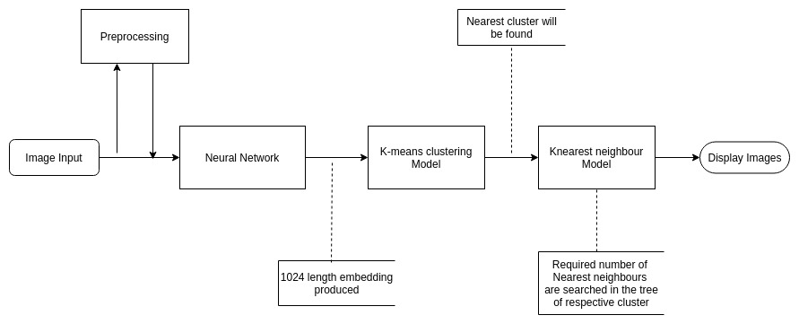

# Image_similarity_search

The image similarity search algorithm takes input query image and displays
the similar images to it as show below.

for training use the command python3 train.py --path_to_training_dir='dataset'

for testing us the command python3 predict_and_display.py --path_to_query_image='dataset/10.jpg' --no_of_images_to_display=10

# How it works

strategy / algo:

Step 1:​ Convert images into embeddings (vector) using a pre-trained CNN model, where these
embeddings will have high variance among the dissimilar images and less variance among the

similar images. In my model I used a mobilenet pre-trained on image-net dataset which is
chopped of fully connected layers (till the last pooling layer) and flattened the pooing layer to get
the 1024 embedding.

Step 2:
Make a reasonable number of clusters using K-means clustering. I my case I got seven clusters.

Step 3:
Construct the nearest neighbour search trees on all the seven clusters for finding the similar
images, I used sklearn BallTree data structure to construct tree (​ sklearn-BallTree​ )

Training stack as shown below:

Inferencing:

Input query image is converted to embedding using the neural network, nearest cluster for that
embedding will be found and similar images in that cluster will be searched using the nearest
neighbours.

